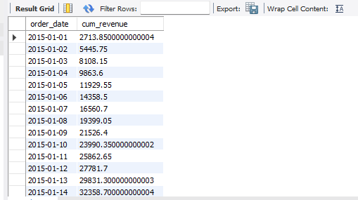
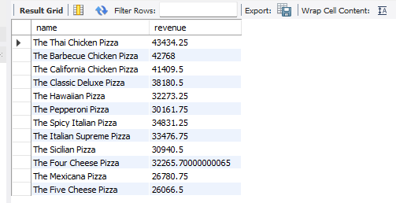

# 🍕 Pizza Sales Data Analysis
## 📊 Project Overview
This project performs a comprehensive analysis of pizza sales data to uncover key business insights. By leveraging MySQL, I analyzed various aspects of sales performance, including revenue trends, customer preferences, and order patterns, to provide data-driven recommendations for business growth.

### The Questions that i wanted to answer through my SQL queries were:
**Basic:**
1. Retrieve the total number of orders placed.
2. Calculate the total revenue generated from pizza sales.
3. Identify the highest-priced pizza.
4. Identify the most common pizza size ordered.
5. List the top 5 most ordered pizza types along with their quantities.

**Intermediate:**
1. Join the necessary tables to find the total quantity of each pizza category ordered.
2. Determine the distribution of orders by hour of the day.
3. Join relevant tables to find the category-wise distribution of pizzas.
4. Group the orders by date and calculate the average number of pizzas ordered per day.
5. Determine the top 3 most ordered pizza types based on revenue.

**Advanced:**
1. Calculate the percentage contribution of each pizza type to total revenue.
2. Analyze the cumulative revenue generated over time.
3. Determine the top 3 most ordered pizza types based on revenue for each pizza category.

SQL queries? Check them out here: 
[project_sql folder](/sql_queries/)

# 🛠️ Tools Used
- **Database:** MySQL Workbench (Data Cleaning & Analysis)
- **SQL IDE:** VS Code (Script management and Documentation)
- **Visualization:** SQL results 
- **GitHub:** Version control and Portfolio hosting

# Analysis 

### 1. Basic Analysis: Business Overview
In this phase, I focused on high-level KPIs (Key Performance Indicators) to understand the scale of operations.

- **Total Volume:** A total of **[21350]** orders were placed during the period, indicating a healthy transaction flow.

- **Revenue Generation:** The project generated a total revenue of **$[817860.05]**. This metric serves as the baseline for all subsequent financial analysis.

- **Pricing Strategy:** The highest-priced pizza is the **[The Greek Pizza]**, priced at **$[35.95]**.

- **Customer Preferences (Size):** The most popular pizza size is **[L]**, suggesting that customers prefer larger portions/value for money.

- **Top 5 Best Sellers:** The following pizza types dominate the sales volume:

        The Classic Deluxe Pizza - [2453] sold

        The Barbecue Chicken Pizza - [2432] sold

        The Hawaiian Pizza - [2422] sold

        The Pepperoni Pizza - [2418] sold

        The Thai Chicken Pizza - [2371] sold

### 2. Intermediate Analysis: Patterns & Trends

Moving beyond basic counts, I joined multiple tables to uncover operational and categorical trends.

- **Category Performance:** By joining pizza_types and order_details, I found that the [Classic] category is the most ordered, showing a strong preference for traditional flavors.

- **Peak Hours:** Order distribution peaks at **[ 12 PM, 2520 orders]**. This insight is critical for staff scheduling and kitchen preparation.

- **Menu Diversity:** The distribution of pizzas across categories is fairly [balanced], with **[32]** unique pizza types available to customers.

- **Daily Order Average:** On average, **[138]** pizzas are ordered per day. This helps in predicting inventory needs for fresh ingredients.

- **Revenue Leaders:** While some pizzas sell more in quantity, the top 3 pizzas by Revenue are:

        The Thai Chicken Pizza ($[43434.25])

        The Barbecue Chicken Pizza ($[42768])

        The California Chicken Pizza ($[41409.5])

### 3. Advanced Analysis: Strategic Deep Dive
In the final phase of the project, I utilized advanced SQL techniques to provide granular insights into revenue distribution and growth trends.

**1.Revenue Contribution by Pizza Type:**

To understand which products are the "Engine" of the business, I calculated the percentage contribution of each pizza type to the total revenue.

```sql
SELECT pizza_types.category,
    round(SUM(order_details.quantity*pizzas.price) / (SELECT 
     round(sum(order_details.quantity * pizzas.price ),2) AS total_sales
FROM order_details 
    JOIN pizzas
    ON pizzas.pizza_id = order_details.pizza_id)* 100,2) AS revenue
FROM pizza_types 
    JOIN pizzas 
    ON pizza_types.pizza_type_id = pizzas.pizza_type_id
    JOIN order_details 
    ON order_details.pizza_id = pizzas.pizza_id
    GROUP BY pizza_types.category
    ORDER BY revenue DESC;
```
**Result:**

    | Category | Revenue (%) |
    |----------|------------|
    | Classic  | 26.91      |
    | Supreme  | 25.46      |
    | Chicken  | 23.96      |
    | Veggie   | 23.68      |

**Key Insight:**

- **Classic pizzas** are the top revenue driver at **26.91%**
- All four categories are fairly balanced (within ~3% of each other)
- **Veggie** contributes the least but still holds a strong **23.68%**


**2. Cumulative Revenue Analysis (Time Series):**

To track business growth over time, I calculated the cumulative (running total) revenue day by day — revealing the overall sales trajectory throughout the year.
```sql
SELECT order_date,
	sum(revenue) OVER(ORDER BY order_date) AS cum_revenue
FROM
(SELECT orders.order_date,
	sum(order_details.quantity*pizzas.price) AS revenue
FROM order_details 
	JOIN pizzas
    ON order_details.pizza_id = pizzas.pizza_id
    JOIN orders
    ON orders.order_id = order_details.order_id
GROUP BY orders.order_date) AS sales;
```

**Result:**

| order_date | cum_revenue |
|------------|-------------|
| 2015-01-01 | 2713.85     |
| 2015-01-02 | 5445.75     |
| 2015-01-03 | 8108.15     |
| 2015-01-04 | 9863.60     |
| 2015-01-05 | 11929.55    |
| 2015-01-06 | 14358.50    |
| 2015-01-07 | 16560.70    |
| 2015-01-08 | 19399.05    |
| 2015-01-09 | 21526.40    |
| 2015-01-10 | 23990.35    |

**Key Insight:**

- Revenue shows a **consistent upward trend** from day one
- The business generated **~$2,713** on the very first day (2015-01-01)
- By just **Day 10**, cumulative revenue crossed **$23,990** — averaging ~$2,399/day
- The steady growth with **no major dips** indicates strong and stable demand



**3. Top 3 Pizzas by Revenue (Category-wise):**

To identify the best-performing products in each category, I used ranking window functions to find the Top 3 revenue-generating pizzas within every pizza category.
```sql
SELECT name,
        revenue
FROM 
(SELECT category,
        name,
        revenue,
        RANK() OVER(PARTITION BY category ORDER BY revenue DESC) AS rn
FROM
(SELECT pizza_types.category,
    pizza_types.name,
    SUM(order_details.quantity * pizzas.price) AS revenue
FROM pizza_types 
    JOIN pizzas
    ON pizza_types.pizza_type_id = pizzas.pizza_type_id
    JOIN order_details
    ON pizzas.pizza_id = order_details.pizza_id
    GROUP BY pizza_types.category, pizza_types.name) AS a) AS b
WHERE rn <= 3;
```

**Result:**

| Category | Pizza Name                  | Revenue ($) |
|----------|-----------------------------|-------------|
| Chicken  | The Thai Chicken Pizza      | 43,434.25   |
| Chicken  | The Barbecue Chicken Pizza  | 42,768.00   |
| Chicken  | The California Chicken Pizza| 41,409.50   |
| Classic  | The Classic Deluxe Pizza    | 38,180.50   |
| Classic  | The Hawaiian Pizza          | 32,273.25   |
| Classic  | The Pepperoni Pizza         | 30,161.75   |
| Supreme  | The Spicy Italian Pizza     | 34,831.25   |
| Supreme  | The Italian Supreme Pizza   | 33,476.75   |
| Supreme  | The Sicilian Pizza          | 30,940.50   |
| Veggie   | The Four Cheese Pizza       | 32,265.70   |
| Veggie   | The Mexicana Pizza          | 26,780.75   |
| Veggie   | The Five Cheese Pizza       | 26,066.50   |

**Key Insight:**

- **Thai Chicken Pizza** is the single highest revenue pizza overall at **$43,434.25**
- The **Chicken category** dominates the top 3 spots with all three pizzas earning **$41K+**
- **Classic** and **Supreme** categories show a noticeable revenue drop after rank 1
- **Veggie** top pizza (Four Cheese) earns **$32,265** — competitive with Classic and Supreme
- Useful for **menu prioritization** and **promotional strategy decisions**



# 🧠 What I Learned

Working on this end-to-end SQL project helped me grow from writing basic queries 
to solving real business problems using advanced SQL techniques.

---

### 📌 1. SQL Fundamentals (Refreshed & Strengthened)
- Writing clean `SELECT` statements with proper formatting
- Filtering data using `WHERE`, `HAVING`, and `BETWEEN`
- Sorting and grouping with `ORDER BY` and `GROUP BY`
- Using aggregate functions — `SUM()`, `COUNT()`, `AVG()`, `ROUND()`

---

### 🔗 2. Joins Across Multiple Tables
- Performing `JOIN` operations across **3 tables simultaneously**
  (`pizza_types` → `pizzas` → `order_details`)
- Understanding how **primary keys and foreign keys** connect tables
- Avoiding duplicate records by structuring joins correctly

---

### 🧩 3. Subqueries
- Writing **subqueries inside `SELECT`** to calculate percentage contributions
- Using **subqueries as derived tables** (`FROM (SELECT ...) AS alias`)
- Building **2-level nested subqueries** for category-wise ranking

---

### 🪟 4. Window Functions *(Most Valuable Skill)*
- `SUM() OVER (ORDER BY ...)` → for **Cumulative Revenue (Running Total)**
- `RANK() OVER (PARTITION BY ... ORDER BY ...)` → for **Top N per Category**
- Understanding the difference between `RANK()`, `DENSE_RANK()` and `ROW_NUMBER()`
- Filtering ranked results using `WHERE rn <= 3`

---

### 📊 5. Business & Data Analytics Thinking
- Translating **business questions into SQL queries**
- Identifying **KPIs** like total revenue, order volume, peak hours
- Drawing **actionable insights** from raw query results
- Structuring an analysis into **Basic → Intermediate → Advanced** levels


###  Key Takeaway
> This project taught me that **SQL is not just about retrieving data —
> it's about asking the right business questions and translating them 
> into structured, optimized queries that drive decisions.**

# 🏁 Conclusion

This project was a complete, end-to-end SQL analysis of a **Pizza Sales Dataset** —
starting from simple data retrieval and building up to advanced business intelligence queries.

---

### 📦 What This Project Covered

| Phase | Focus | Techniques Used |
|-------|-------|-----------------|
| **Basic** | Data exploration & counts | `SELECT`, `COUNT`, `LIMIT` |
| **Intermediate** | Revenue & order patterns | `JOIN`, `GROUP BY`, `HAVING` |
| **Advanced** | Trends & rankings | Subqueries, Window Functions |

---

### 📈 Key Business Findings

- **Classic Pizza** is the top revenue category at **26.91%**
- **Thai Chicken Pizza** is the single best-selling pizza by revenue (**$43,434**)
- Revenue grew **consistently day over day** with no major slumps
- All four pizza categories contribute **fairly equally** to total revenue
- Peak order hours and best-selling sizes offer clear **operational insights**

---

### 🚀 How This Prepares Me for Real-World Roles

This project simulates the kind of analysis a **Data Analyst** performs daily —
understanding a business through its data, identifying trends, and presenting
findings in a clear, structured way.

The skills demonstrated here — **multi-table JOINs, subqueries, window functions,
and business storytelling** — are directly applicable to roles in:

- 📊 Data Analytics
- 🏢 Business Intelligence
- 🛒 E-commerce & Retail Analysis
- 📉 Sales & Revenue Reporting

---

### 🙏 Acknowledgement

> This project was built by following the guided tutorial by
> **[Ayushi Jain on YouTube](https://www.youtube.com/watch?v=zZpMvAedh_E)**
> and then independently documented, structured, and published
> as a personal portfolio project.

---

### 📬 Let's Connect

If you found this project helpful or have feedback, feel free to reach out!

[](https://github.com/Nir-2015)
[](https://www.linkedin.com/in/nirmal-gangoda-399a7225a/)
